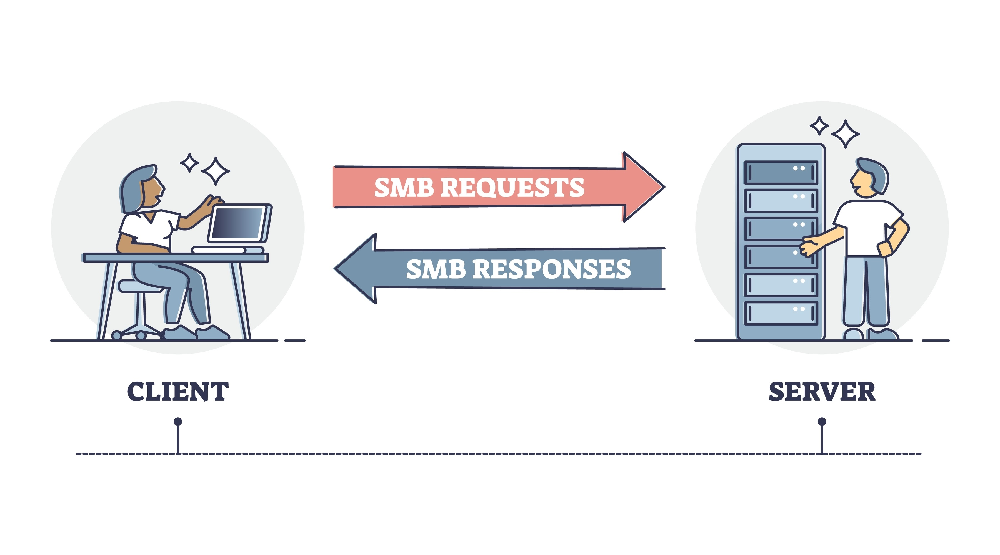

# Nodemon und Concurrently

Das Nodemon-TypeScript-Setup erfordert zwei Prozesse, die unbegrenzt laufen: `tsc --watch` und `nodemon`. Da keiner von beiden von selbst beendet wird, können sie nicht mit `&&` gestartet werden – dieser Operator wartet darauf, dass der erste Befehl abgeschlossen ist, bevor er den zweiten ausführt, sodass der zweite Befehl niemals starten würde. `concurrently` löst dieses Problem, indem es mehrere Befehle gleichzeitig in einem einzigen Terminal ausführt. Installiere es als Dev-Abhängigkeit mit `npm install --save-dev concurrently`.

---

## Konfiguration

Jeder Prozess erhält ein eigenes benanntes Skript, damit er unabhängig oder als Teil des kombinierten `dev`-Befehls ausgeführt werden kann:

- `build:watch` führt den TypeScript-Compiler im Watch-Modus aus
- `start:dev` startet nodemon gegen die kompilierte Ausgabe
- `dev` übergibt beide Skriptaufrufe als Zeichenketten in Anführungszeichen an `concurrently`

```json
// package.json
{
  "scripts": {
    "build:watch": "tsc --watch",
    "start:dev": "nodemon dist/index.js",
    "dev": "concurrently \"npm run build:watch\" \"npm run start:dev\""
  },
  "devDependencies": {
    "concurrently": "^8.2.2",
    "nodemon": "^3.0.1"
  }
}
```

Die Anführungszeichen um jeden `npm run`-Befehl werden mit `\"` maskiert, weil der gesamte Wert des `dev`-Skripts bereits in doppelten Anführungszeichen steht. `concurrently` erhält jeden Befehl als separates Argument und führt sie parallel aus.

`npm run dev` startet beide Prozesse. Das Terminal zeigt die verschränkte Ausgabe von `tsc --watch` und `nodemon` und ermöglicht so den vollständigen Kompilier- und Neustart-Zyklus in einem einzigen Fenster.

---

## Ressourcen

- [concurrently auf npm](https://www.npmjs.com/package/concurrently)

